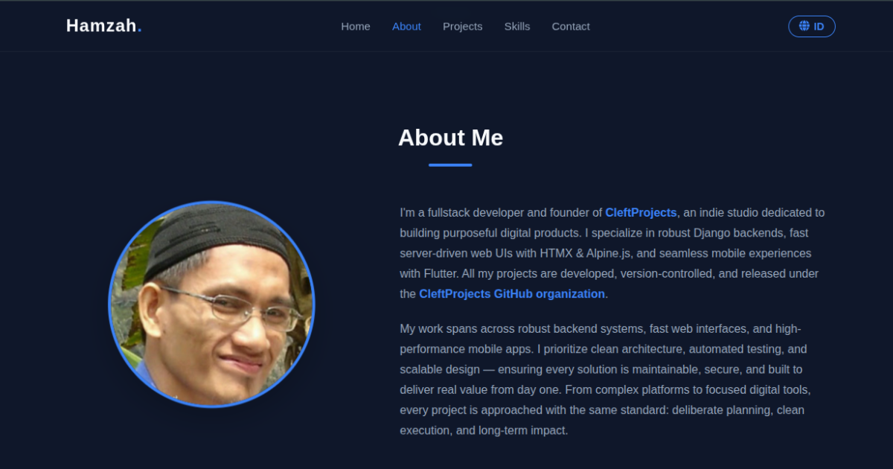

# Hamzah | Fullstack Developer Portfolio



> **Finding gaps. Building solutions.**  
> Personal portfolio of Hamzah, a Fullstack Developer and Founder of [CleftProjects](https://cleftprojects.github.io).

##  Live Demo
Visit the live site: **[hamzahsby.github.io](https://hamzahsby.github.io)**

## 📖 About This Project
This is my personal portfolio website, designed to showcase my expertise in building robust web systems and high-performance mobile applications. It reflects my philosophy as an indie developer: **intentional planning, clean execution, and long-term impact.**

The website itself is built with a focus on performance, accessibility, and clean code architecture, serving as a testament to my development standards. All my professional works are developed and maintained under the **[CleftProjects](https://github.com/cleftprojects)** organization.

## 🛠️ Tech Stack

### Core Technologies
- **Frontend:** HTML5, CSS3, JavaScript (ES6+)

### Tools & Workflow
- **Version Control:** Git & GitHub
- **Deployment:** GitHub Pages
- **Form Handling:** Formspree
- **Design Principles:** Mobile-First, Semantic HTML, BEM-like CSS naming

## ✨ Key Features

- **🌐 Bilingual Support (EN/ID):** Seamless language toggling without page reload.
- **📱 Fully Responsive:** Optimized layout for mobile, tablet, and desktop devices.
- **⚡ Performance Optimized:** Lazy loading images, minimal external dependencies, and efficient CSS animations.
- **♿ Accessibility Focused:** Semantic HTML structure and proper ARIA labels.
- **🎨 Modern Dark UI:** Clean, professional aesthetic with consistent color variables.
- **🔍 SEO Ready:** Complete meta tags, Open Graph integration, and JSON-LD structured data.

## 📂 Project Structure

```text
/
├── index.html          # Main entry point
├── style.css           # Global styles, variables, and responsive design
├── script.js           # Interactivity (Language toggle, Smooth scroll, Form handling)
├── README.md           # Project documentation
├── assets/
│   └── images/
│       ├── icons/      # Favicon & Apple Touch Icons
│       ├── projects/   # Screenshots for featured projects
│       ├── og-image.jpg # Social media preview image
│       └── profile-hamzah.jpg # Personal profile photo
└── ...
```

## 🧩 Featured Projects

All my professional works are developed and maintained under the **[CleftProjects](https://github.com/cleftprojects)** organization.

## 📬 Contact & Collaboration

I'm always open to discussing new projects, creative opportunities, or just talking about tech.

- **Email:** [hamzah.sby@gmail.com](mailto:hamzah.sby@gmail.com)
- **GitHub Org:** [github.com/cleftprojects](https://github.com/cleftprojects)
- **Studio Site:** [cleftprojects.github.io](https://cleftprojects.github.io)

## 📝 License

This project is open source and available under the [MIT License](LICENSE).

---
*Built with dedication by Hamzah.*
